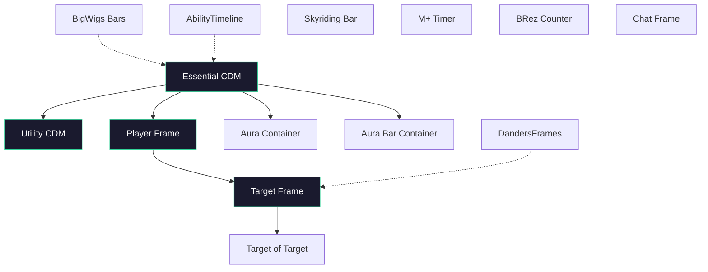

# Frame Layout

QUI's frame layout system controls how every HUD element is positioned, layered, and scaled on your screen. Rather than placing each frame independently and hoping nothing overlaps, the anchoring system lets you attach frames to each other so they move as a group and maintain consistent spacing. The layering system ensures the right elements render on top when frames overlap.

## Overview

The layout system has three pillars: **anchoring** (which frames attach to which), **HUD layering** (which frames render on top of others), and **pixel-perfect scaling** (ensuring crisp edges at any resolution). Together, these give you a modular HUD where moving one element can reposition an entire cluster, and where overlapping elements have a predictable visual order.

## How to Configure

Frame layout settings are spread across several locations:

- **Layout Mode** (`/qui layout`) -- The primary tool for positioning QUI frames. Provides an edge-docked slide-out toolbar, settings panels for each frame, a drawer with collapsible groups, and drag handles for repositioning. CDM, Group Frames, and Minimap settings are accessed here.
- **Frame Positioning** tab in `/qui` -- Configure anchor relationships between QUI elements and other frames.
- **Frame Levels** tab in `/qui` -- Set frame level priorities to control render order.

## Key Features

### Anchoring System

The anchoring system uses `frameAnchoring` as its single source of truth for frame positions. Handle positioning uses parent handles, and all resolvers work through this unified system.

The diagram above shows a typical anchoring setup. Solid arrows represent anchor relationships (child anchored to parent). Dashed arrows show optional third-party addon anchoring. Moving the Essential CDM bar repositions the Utility bar, Player frame, and aura containers as a group.

- **Anchor QUI frames to each other** -- Attach one QUI element to another so they maintain a fixed spatial relationship. When the parent moves, the child follows.
- **Anchor to Blizzard frames** -- Attach QUI elements to default Blizzard frames or third-party addon frames.
- **Available anchor targets** -- The system supports anchoring to: Essential CDM, Utility CDM, primary and secondary power bars, Player unit frame, Target unit frame, Skyriding bar, Combat Timer, M+ Timer, BRez Timer, ExtraActionButton, BigWigs bars, DandersFrames, AbilityTimeline / Better Timeline, main chat frame, custom tracker bars, and action bars.
- **Anchor point control** -- For each anchor relationship, you choose the source and target anchor points (TOP, BOTTOM, LEFT, RIGHT, CENTER, and corner combinations), plus X/Y offsets and gap values.
- **Unit frame anchoring** -- Player and Target unit frames can anchor directly to CDM elements, keeping your core combat HUD as a single cohesive unit.
- **Container anchoring** -- CDM containers (aura, aura bar) can anchor to other CDM elements, maintaining consistent positioning relative to your cooldown display.
- **Utility auto-anchor** -- The Utility container can automatically position itself below the Essential container without manual offset configuration.
- **DandersFrames integration** -- If DandersFrames is installed, you can anchor its party, raid, and pinned frames to QUI elements, and use the QUI Target unit frame as an anchor target. Container anchoring is supported for DandersFrames preview frames.
- **Boss frame proxy mover** -- Boss frames use a proxy mover that reparents correctly within the anchoring system.

### HUD Layering

- **Priority-based frame levels** -- Each HUD element is assigned a priority value from 0 to 10. Higher priority elements render on top of lower priority ones.
- **Consistent frame level math** -- Priorities are translated to WoW frame levels using a base of 100 and a step of 20, ensuring clean separation between layers without frame level collisions.
- **Frame Levels tab** -- The `/qui` options panel includes a dedicated Frame Levels tab where you can adjust the layer priority for every QUI element.

### Scaling and Positioning

- **Pixel-perfect scaling** -- QUI calculates a scale factor that ensures 1 pixel in the addon equals 1 physical pixel on your display. This eliminates blurry edges on bars, borders, and icons regardless of your UI scale or resolution.
- **Minimum HUD width** -- A configurable minimum width for the overall HUD area, preventing elements from collapsing too narrowly on very high resolution or ultra-wide displays.
- **Nudge amount** -- Fine-positioning control that determines how many pixels an element moves per nudge. Defaults to 1 pixel for precise placement.

## Important Settings

| Setting | Description | Default |
|:--------|:------------|:--------|
| Source anchor point | Where on the child frame the anchor attaches | Varies |
| Target anchor point | Where on the parent frame the anchor attaches | Varies |
| Offset X/Y | Pixel offset from the anchor point | 0, 0 |
| Gap | Spacing between anchored elements | Varies |
| HUD layer priority | Render order priority per element (0-10) | Varies |
| Minimum HUD width | Minimum pixel width for the HUD area | Configurable |
| Nudge amount | Pixels per nudge step for fine positioning | 1 |
| Utility auto-anchor | Automatically place Utility bar below Essential | Enabled |

## Tips

{: .note }
Anchoring is the most efficient way to build a compact HUD. Start by positioning your Essential CDM bar, then anchor your Utility bar, unit frames, and other elements to it. Moving the Essential bar then repositions your entire combat cluster as one unit.

{: .important }
HUD layering priorities only matter when frames overlap. If your layout has no overlapping elements, the default priorities are fine. Adjust them when you intentionally stack elements -- for example, placing the combat timer on top of the CDM bar.

{: .note }
Pixel-perfect scaling recalculates whenever your resolution or UI scale changes. If you notice blurry frame edges after changing display settings, type `/reload` to force a recalculation.

{: .note }
The DandersFrames integration requires DandersFrames to be installed and active. QUI detects its presence automatically -- no manual setup is needed beyond configuring the anchor relationships in the Frame Anchoring tab.
