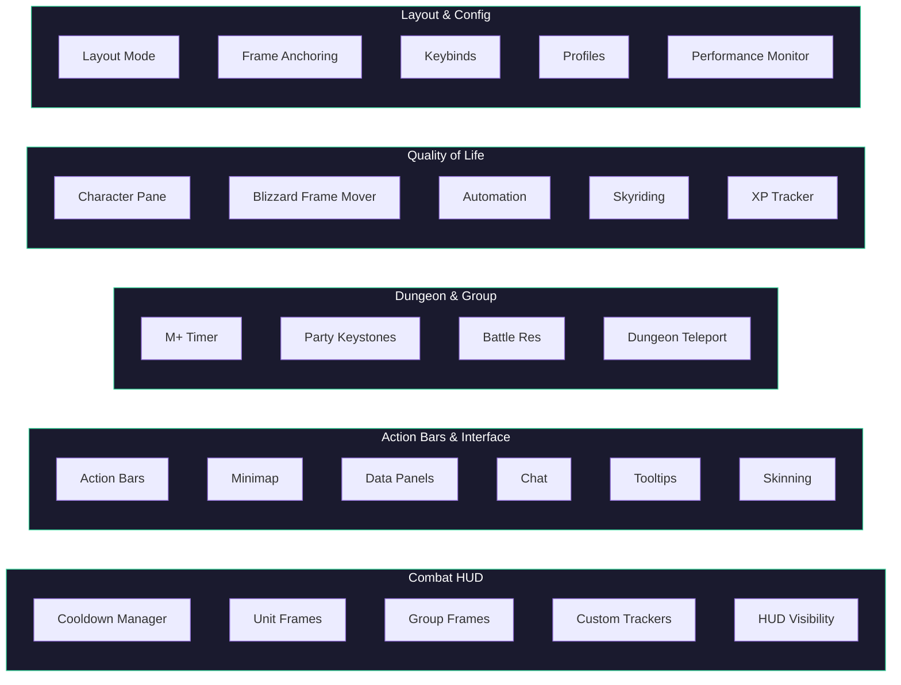

# Features

QUI provides a comprehensive set of UI modules that can be individually enabled or disabled to suit your playstyle. Whether you want a complete UI overhaul or just a few targeted improvements, you can pick and choose exactly what QUI manages.

## Feature Map

## Feature Areas

- [Cooldown Manager]() -- QUI's flagship feature. Displays ability cooldowns as configurable icon containers near your character with glow effects, swipe overlays, range indicators, Composer for per-spell customization, and flexible container types (cooldown, aura, aura bar).

- [Unit Frames]() -- Replaces Blizzard's unit frames for Player, Target, Focus, Pet, Boss, and more. Includes castbars, auras, absorb shields, heal prediction, portraits, and extensive color and layout options.

- [Group Frames]() -- Opt-in replacement for Blizzard party and raid frames. Separate party/raid profiles, auto-scaling layouts, click-casting with scroll wheel and ping support, Composer, dispel overlays, custom aura indicators, spotlight pinning, and healer-focused features.

- [Action Bars]() -- Native action bar engine enhancing all 8 standard action bars plus pet, stance, and special bars. Mouseover fade, per-bar style overrides, range and usability indicators, and button spacing controls.

- [Chat]() -- Enhances the default chat window with a glass effect, clickable URLs, message fade, timestamps, copy button, and edit box styling.

- [Tooltips]() -- Reskins tooltips with QUI's dark theme, adds cursor anchoring, combat hiding, class-colored names, spell/item IDs, guild rank, M+ rating, and per-context visibility with modifier key controls.

- [Character Pane]() -- Enhances the character and inspect frames with item level overlays, enchant status, gem indicators, durability bars, avoidance/stagger stats, PvP iLvl, and customizable stats formatting.

- [Skinning]() -- Applies QUI's visual theme to Blizzard frames including the game menu, loot window, objective tracker, keystone frame, ready check, status bars, and more.

- [Minimap & Data Panels]() -- Full minimap customization with shape, border, button drawer, clock, coordinates, zone text, and element visibility controls. See also [Data Panels]().

- [Dungeon Features]() -- M+ timer, party keystones, dungeon teleport, battle res counter, combat timer, and automatic combat logging for dungeons and raids.

- [Quality of Life]() -- Automation features including junk selling, auto repair, consumable checks, popup blocking, pet warnings, focus cast alerts, Blizzard Frame Mover, and missing raid buff display.

- [Custom Trackers]() -- User-defined spell and item tracking bars with dynamic layouts, clickable icons, and independent visibility rules.

- [Skyriding]() -- Custom vigor bar for Skyriding with segmented display, Second Wind progress, speed readout, and Thrill of the Skies color change.

- [XP Tracker]() -- XP progress bar with rested XP overlay, details panel, and hover-to-show option.

- [HUD Visibility]() -- Visibility rule system for CDM, Unit Frames, and Custom Trackers. Show/hide based on combat, target, group, mounting, flying, and more.

- [Frame Layout]() -- Layout Mode with edge-docked toolbar for positioning frames, anchoring system for relative positioning, HUD layering priorities, and DandersFrames/BigWigs/AbilityTimeline integration.

- [Keybinds & Integrations]() -- LibKeyBound keybind mode, keybind display on CDM and action bars, and third-party addon integrations (DandersFrames, BigWigs, Plater, LibDualSpec).

- [Blizzard Frame Mover]() -- Drag-and-drop repositioning for default Blizzard UI frames without entering Edit Mode. Positions persist across sessions.

- [Performance Monitor]() -- Real-time diagnostics showing per-addon memory usage, event frequency, and CPU monitoring. Access with `/qui perf`.

- [Data Panels]() -- Configurable information displays for gold, FPS, latency, durability, guild info, and more. Assignable to minimap slots or standalone panels.

Every module reads its settings from the QUI profile database, so your configuration travels with your profile. Open the options panel with `/qui` to explore what each module offers.
