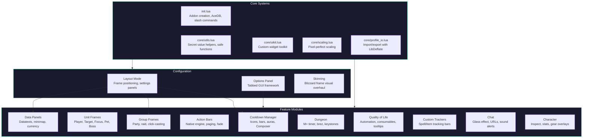

# QUI Documentation
{: .fs-9 }

A comprehensive UI customization addon for World of Warcraft Midnight (12.0+).
{: .fs-6 .fw-300 }

**Current Version: 2.55.2**
{: .label .label-green }

[Get Started](getting-started/){: .btn .btn-primary .fs-5 .mb-4 .mb-md-0 .mr-2 }
[View on GitHub](https://github.com/zol-wow/QUI){: .btn .fs-5 .mb-4 .mb-md-0 }

---

## What is QUI?

QUI (QuaziiUI Community Edition) is a fully-featured World of Warcraft addon that replaces and enhances large parts of the default UI. Originally created by **Quazii**, it is now community maintained by **Zol**.

QUI provides a unified configuration panel for managing unit frames, cooldowns, action bars, group frames, and much more -- all from a single addon. No WeakAuras or complex multi-addon setups required.

---

## Feature Overview

### Combat HUD

| Feature | Description |
|:--------|:------------|
| [**Cooldown Manager**](features/cooldown-manager) | Track abilities, buffs, and debuffs with configurable icon containers, aura bars, Composer, per-spell settings, glow effects, and swipe overlays. |
| [**Unit Frames**](features/unit-frames) | Custom Player, Target, Focus, Pet, Boss, and Target of Target frames with cast bars, aura filtering, absorb shields, heal prediction, and resource bars. |
| [**Group Frames**](features/group-frames) | Party and raid frames with auto-scaling, click-casting (including scroll wheel and ping), dispel overlays, spotlight pinning, and per-spec settings. |
| [**Custom Trackers**](features/custom-trackers) | User-defined spell and item tracking bars with dynamic layouts, clickable icons, equipment slot tracking, and independent visibility rules. |
| [**HUD Visibility**](features/hud-visibility) | Automatic show/hide rules for CDM, unit frames, and trackers based on combat, target, group, mounting, instance, and mouseover. |

### Action Bars & Interface

| Feature | Description |
|:--------|:------------|
| [**Action Bars**](features/action-bars) | Native action bar engine with clean styling, mouseover fade, per-bar overrides, range and usability indicators, and button spacing. |
| [**Minimap & Data Panels**](features/minimap-datatext) | Full minimap customization with button drawer, clock, coordinates, and configurable data panels for stats, currency, and system info. |
| [**Chat**](features/chat) | Enhanced chat with glass effect, clickable URLs, timestamps, message fade, copy button, and sound alerts. |
| [**Tooltips**](features/tooltips) | Reskinned tooltips with cursor anchoring, combat hiding, class-colored names, spec/iLvl/M+ rating display, guild rank, and item IDs. |
| [**Skinning**](features/skinning) | Visual overhaul of Blizzard frames including game menu, alerts, loot, objective tracker, keystone, ready check, status bars, and more. |

### Dungeon & Group Content

| Feature | Description |
|:--------|:------------|
| [**M+ Timer**](features/dungeon-features) | Custom Mythic Plus timer with death counter, affix display, forces bar, and configurable panel backdrop. |
| [**Party Keystones**](features/dungeon-features) | See group members' keystone levels on the M+ tab. |
| [**Battle Res Counter**](features/dungeon-features) | Real-time battle res charge tracking with color-coded availability. |
| [**Dungeon Teleport**](features/dungeon-features) | Click-to-teleport on dungeon icons for earned teleports. |
| [**Auto Combat Log**](features/dungeon-features) | Automatic combat logging in M+ and raids. |

### Character & Quality of Life

| Feature | Description |
|:--------|:------------|
| [**Character Pane**](features/character-pane) | Enhanced character and inspect frames with iLvl overlays, enchant warnings, gem indicators, durability bars, avoidance, stagger, and PvP iLvl. |
| [**Blizzard Frame Mover**](features/blizzard-frame-mover) | Drag-and-drop repositioning for Blizzard UI elements outside of Edit Mode. |
| [**Quality of Life**](features/quality-of-life) | Vendor automation, quest automation, consumable checks, popup blocking, pet warnings, focus cast alerts, combat text, and missing raid buff display. |
| [**Skyriding**](features/skyriding) | Custom vigor bar with segmented charges, Second Wind indicator, speed display, and Thrill of the Skies color change. |
| [**XP Tracker**](features/xp-tracker) | XP progress bar with rested XP overlay and session statistics panel. |

### Layout & Configuration

| Feature | Description |
|:--------|:------------|
| [**Layout Mode**](features/frame-layout) | Edge-docked toolbar for positioning frames, settings panels, drawer with collapsible groups, and CDM Composer. |
| [**Frame Anchoring**](features/frame-layout) | Anchor frames to each other for grouped positioning. Supports DandersFrames, BigWigs, and AbilityTimeline. |
| [**Keybinds & Integrations**](features/keybinds-integrations) | LibKeyBound keybind mode, keybind display on icons, and third-party addon integrations. |
| [**Profiles**](getting-started/profiles) | Full profile management with import/export, partial imports, per-spec switching, and bundled presets. |
| [**Performance Monitor**](features/performance-monitor) | Real-time memory, event frequency, and CPU usage monitoring for debugging. |

---

## Architecture

---

## Quick Start

1. **Install QUI** from [CurseForge](https://www.curseforge.com/wow/addons/qui-community-edition) or your preferred addon manager.
2. **Log in** to World of Warcraft and enter any character.
3. **Type `/qui`** in chat to open the QUI settings panel.
4. **Import the Edit Mode layout** from the Import tab, then import a QUI profile preset.
5. **Type `/qui layout`** to enter Layout Mode and position your frames.

For detailed instructions, see the [Getting Started](getting-started/) guide.

---

## Documentation Sections

- [**Getting Started**](getting-started/) -- Installation, first-time setup, profiles, slash commands, troubleshooting, and FAQ.
- [**Features**](features/) -- In-depth guides for each QUI module and subsystem.
- [**Settings**](settings/) -- Reference for all configuration options.

---

## Community

- [GitHub](https://github.com/zol-wow/QUI) -- Source code, issue tracking, and contributions.
- [Discord](https://discord.gg/FFUjA4JXnH) -- Community support and discussion.
- [CurseForge](https://www.curseforge.com/wow/addons/qui-community-edition) -- Downloads and reviews.
- [Ko-fi](https://ko-fi.com/zol__) -- Support the project.
